<div dir="rtl">

# Stage5 Application - מערכת אימות JWT עם אינטגרציית Flask

## סקירה כללית

זוהי מערכת אימות מתקדמת המשלבת שלוש טכנולוגיות:
- **React Frontend** - ממשק משתמש מודרני עם Vite
- **Spring Boot Backend** - שרת Java עם אבטחת JWT
- **Flask Python Service** - שירות עיבוד נתונים נוסף
- **MySQL Database** - בסיס נתונים יחסי

## ארכיטקטורה כללית

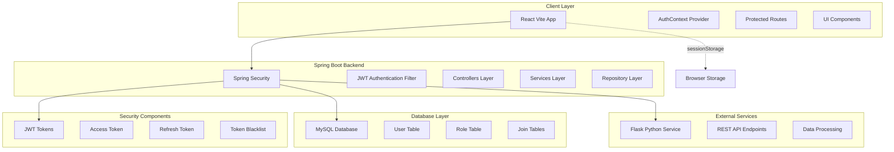

## זרימת אימות מלאה

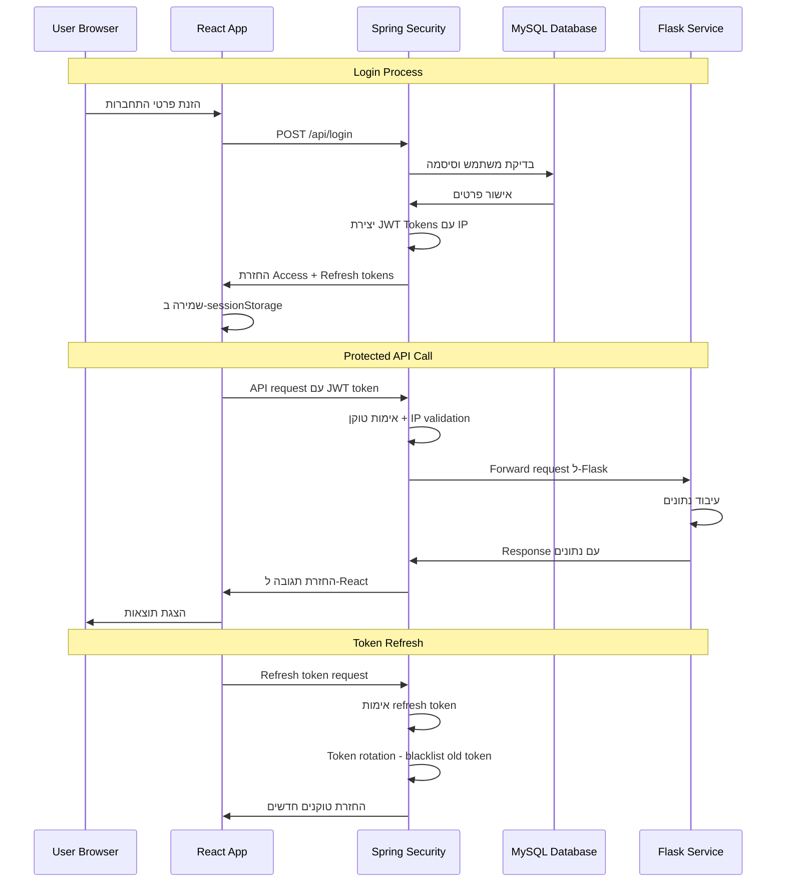

## מבנה Frontend - React

### Component Hierarchy

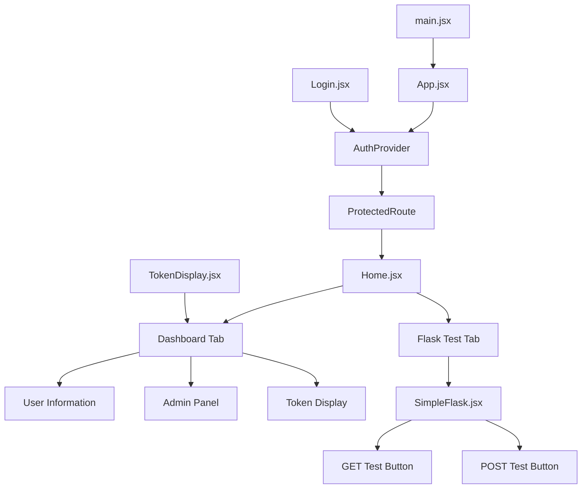

### State Management Flow

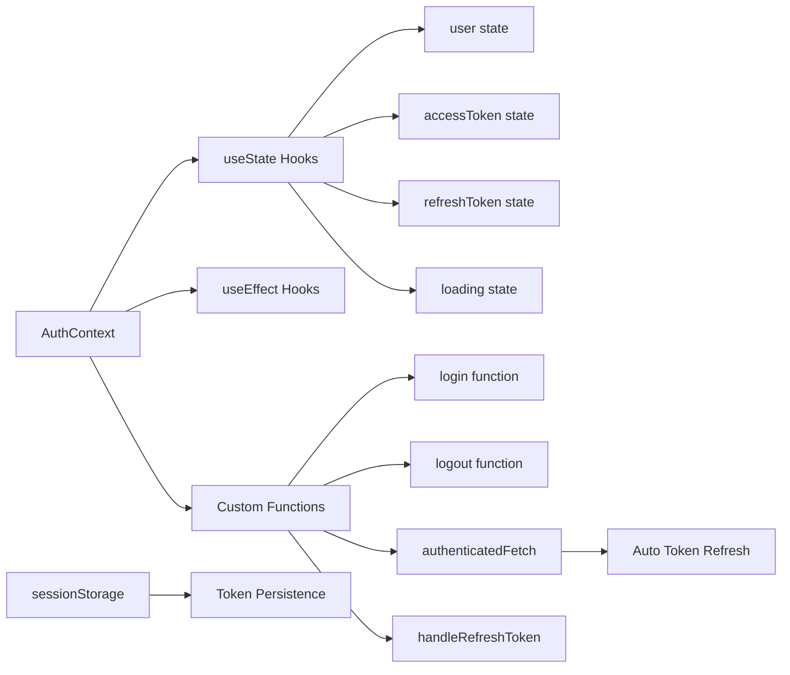

### Authentication Flow in React

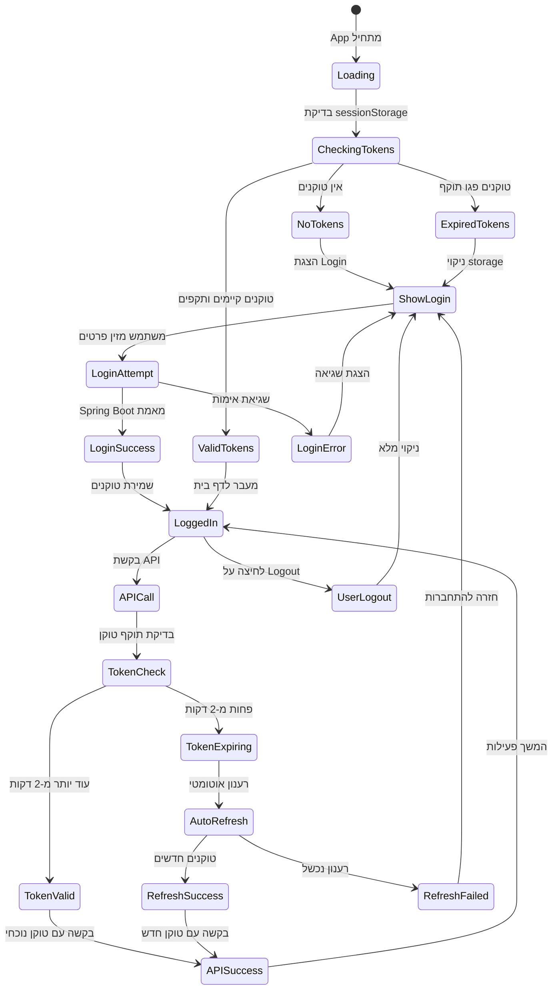

## Backend Architecture - Spring Boot

### Layer Structure

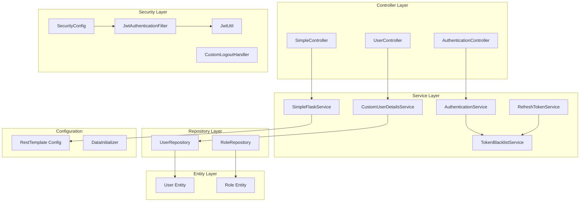

### JWT Security Flow

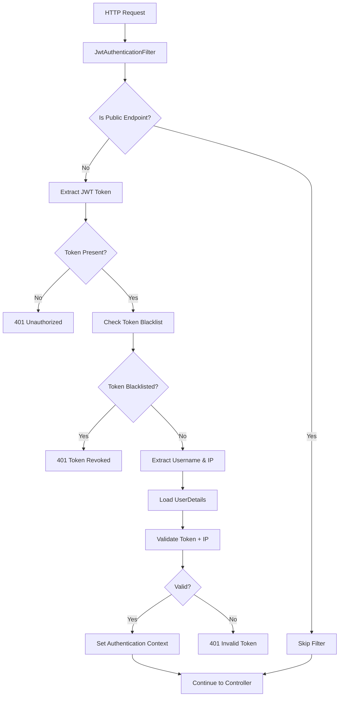

### Database Schema

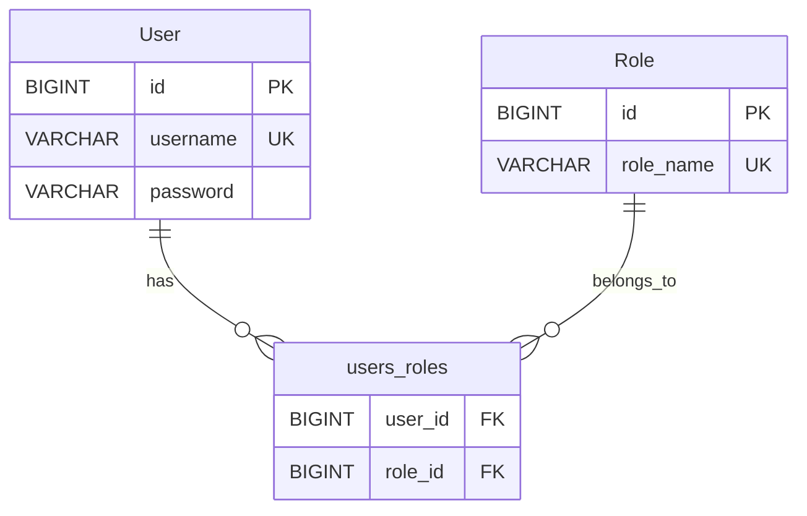

### Token Management

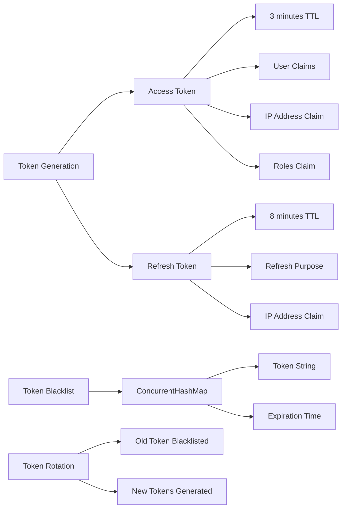

## Flask Integration

### Flask Service Structure

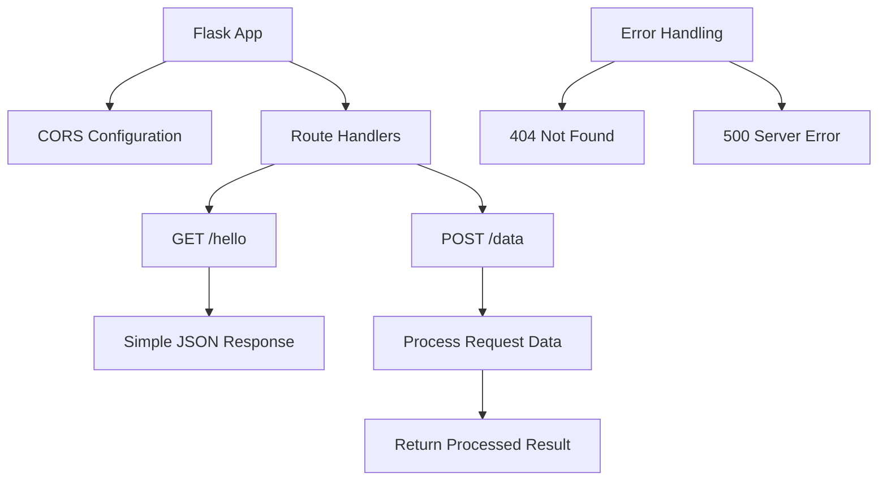

### Communication Flow

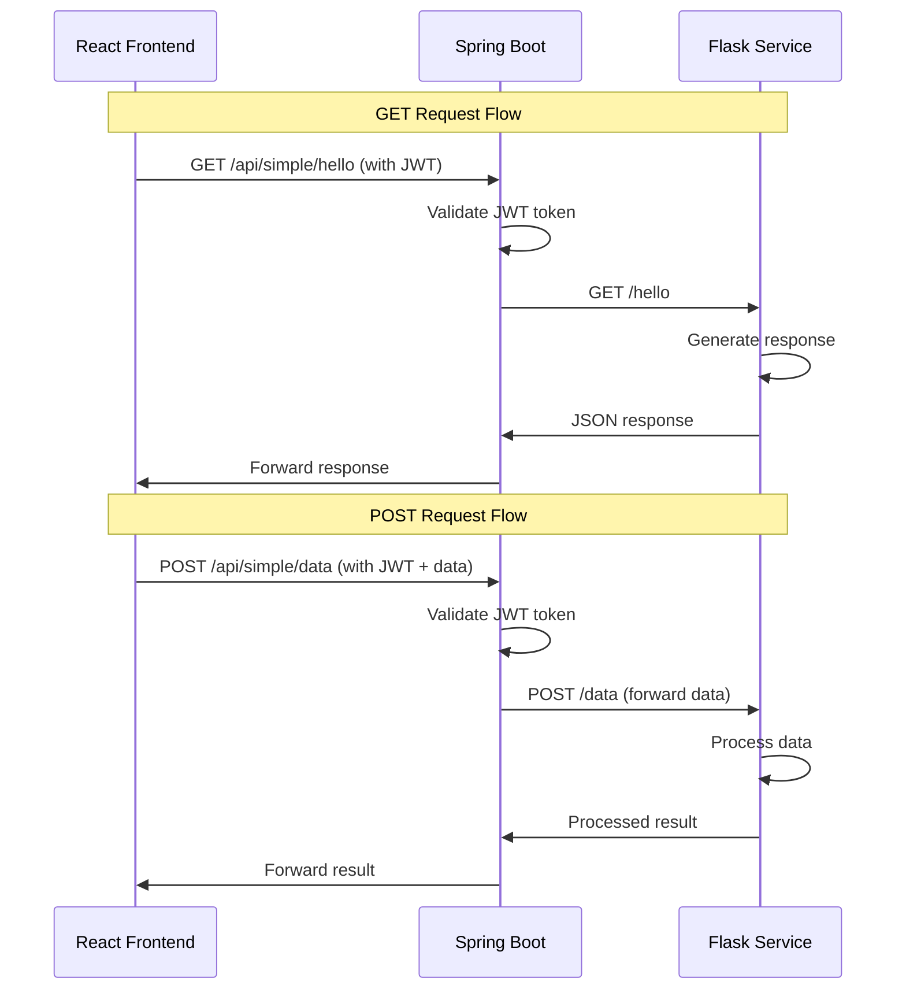

## Security Implementation

### JWT Token Structure

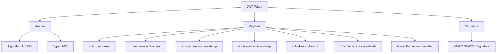

### Security Layers

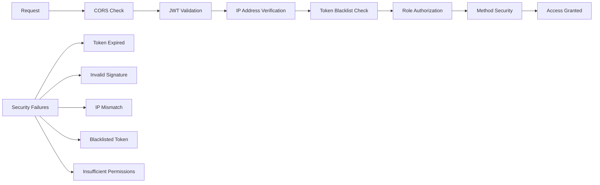

## Development Setup

### Prerequisites

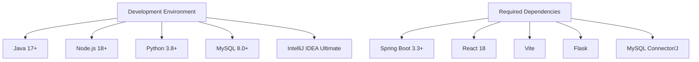

### Service Ports

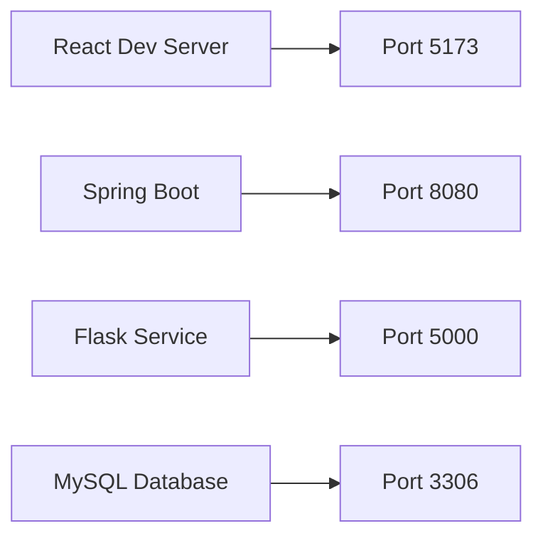

## API Endpoints

### Spring Boot Endpoints

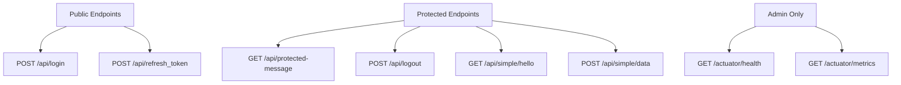

### Flask Endpoints

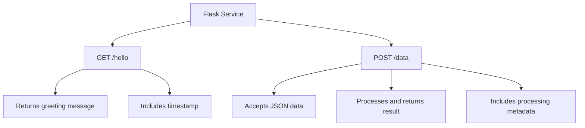

## Error Handling Strategy

### Frontend Error Handling

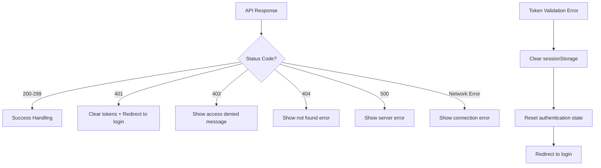

### Backend Error Handling

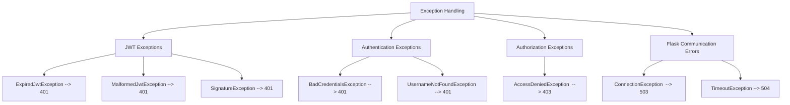

## Performance Optimizations

### Token Management Optimization

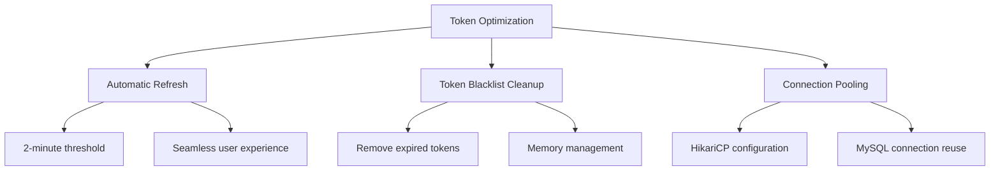

### Caching Strategy

```mermaid
graph TD
    A[Caching Layers] --> B[Browser sessionStorage]
    A --> C[Spring Boot in-memory cache]
    A --> D[MySQL query optimization]
    
    B --> E[JWT tokens]
    B --> F[User session data]
    
    C --> G[Token blacklist]
    C --> H[User details cache]
    
    D --> I[Connection pooling]
    D --> J[Query result caching]
```

## Testing Strategy

### Test Pyramid

```mermaid
graph TD
    A[Testing Strategy] --> B[Unit Tests]
    A --> C[Integration Tests]
    A --> D[End-to-End Tests]
    
    B --> E[React Component Tests]
    B --> F[Spring Boot Service Tests]
    B --> G[Flask Function Tests]
    
    C --> H[API Integration Tests]
    C --> I[Database Integration Tests]
    C --> J[Security Filter Tests]
    
    D --> K[Full Application Flow]
    D --> L[User Journey Tests]
    D --> M[Cross-Service Communication]
```

## Production Deployment

### Deployment Architecture

```mermaid
graph TB
    subgraph "Load Balancer"
        A[Nginx/Apache]
    end
    
    subgraph "Frontend"
        B[React Build]
        C[Static Files]
    end
    
    subgraph "Backend Services"
        D[Spring Boot Instance 1]
        E[Spring Boot Instance 2]
        F[Flask Service]
    end
    
    subgraph "Database"
        G[MySQL Primary]
        H[MySQL Replica]
    end
    
    subgraph "Monitoring"
        I[Application Logs]
        J[Health Checks]
        K[Metrics Collection]
    end
    
    A --> B
    A --> D
    A --> E
    D --> F
    E --> F
    D --> G
    E --> G
    G --> H
```

### Environment Configuration

```mermaid
graph TD
    A[Environment Configs] --> B[Development]
    A --> C[Staging]
    A --> D[Production]
    
    B --> E[H2 Database]
    B --> F[Debug Logging]
    B --> G[CORS Enabled]
    
    C --> H[MySQL Database]
    C --> I[Info Logging]
    C --> J[Limited CORS]
    
    D --> K[MySQL Cluster]
    D --> L[Error Logging Only]
    D --> M[Strict Security]
    D --> N[SSL/TLS Enabled]
```

## Monitoring and Observability

### Health Monitoring

```mermaid
graph TD
    A[Health Monitoring] --> B[Application Health]
    A --> C[Database Health]
    A --> D[Service Integration Health]
    
    B --> E[Spring Boot Actuator]
    B --> F[React App Status]
    B --> G[Flask Service Status]
    
    C --> H[MySQL Connection Pool]
    C --> I[Query Performance]
    C --> J[Storage Utilization]
    
    D --> K[Spring-Flask Communication]
    D --> L[Authentication Flow]
    D --> M[Token Validation]
```

### Logging Strategy

```mermaid
graph TD
    A[Logging Levels] --> B[DEBUG]
    A --> C[INFO]
    A --> D[WARN]
    A --> E[ERROR]
    
    F[Log Categories] --> G[Authentication Events]
    F --> H[API Requests/Responses]
    F --> I[Database Operations]
    F --> J[Security Events]
    F --> K[Flask Communication]
    
    L[Log Destinations] --> M[Console Output]
    L --> N[File Logs]
    L --> O[Centralized Logging]
```

## הוראות הפעלה מלאות

### סדר הפעלה

```mermaid
graph TD
    A[Start Services] --> B[1. Start MySQL]
    B --> C[2. Start Flask Service]
    C --> D[3. Start Spring Boot]
    D --> E[4. Start React Dev Server]
    
    F[Verification] --> G[Check MySQL Connection]
    G --> H[Test Flask Endpoints]
    H --> I[Verify Spring Boot Health]
    I --> J[Access React Application]
```

### Database Setup

```sql
-- Create database
CREATE DATABASE IF NOT EXISTS schema_jwt_2024 
CHARACTER SET utf8mb4 
COLLATE utf8mb4_unicode_ci;

-- Use database
USE schema_jwt_2024;

-- Tables will be created automatically by Hibernate
-- with spring.jpa.hibernate.ddl-auto=update
```

### Environment Variables

```properties
# application.properties
spring.application.name=Stage5
spring.datasource.url=jdbc:mysql://localhost:3306/schema_jwt_2024?createDatabaseIfNotExist=true
spring.datasource.username=root
spring.datasource.password=admin
spring.jpa.hibernate.ddl-auto=update
spring.jpa.show-sql=true
flask.server.url=http://localhost:5000
server.port=8080
```

### Flask Dependencies

```bash
# requirements.txt
Flask==2.3.3
Flask-CORS==4.0.0
```

### React Dependencies

```json
{
  "dependencies": {
    "react": "^18.2.0",
    "react-dom": "^18.2.0"
  },
  "devDependencies": {
    "@vitejs/plugin-react": "^4.0.3",
    "vite": "^4.4.5"
  }
}
```

## סיכום טכני

מערכת Stage5 מדגימה ארכיטקטורה מודרנית עם:

### חוזקות המערכת
- **אבטחה מתקדמת** עם JWT וvalidation מבוסס IP
- **ארכיטקטורה מודולרית** עם הפרדה ברורה של שכבות
- **אוטומציה מלאה** של ניהול טוקנים ורענון
- **אינטגרציה רב-שירותית** בין React, Spring Boot ו-Flask
- **ניהול מצב מתקדם** עם React Context API
- **טיפול מקיף בשגיאות** ברמת המערכת
- **תמיכה בהרשאות** מבוססות תפקידים

### טכנולוגיות מרכזיות
- **Frontend**: React 18, Vite, Context API, sessionStorage
- **Backend**: Spring Boot 3.3+, Spring Security, JWT
- **Database**: MySQL 8.0+ עם JPA/Hibernate
- **Integration**: RESTful APIs, CORS, HTTP clients
- **Security**: JWT tokens, IP validation, token blacklisting

המערכת מספקת בסיס איתן לאפליקציות enterprise עם דרישות אבטחה גבוהות ואינטגרציה מורכבת.

</div>